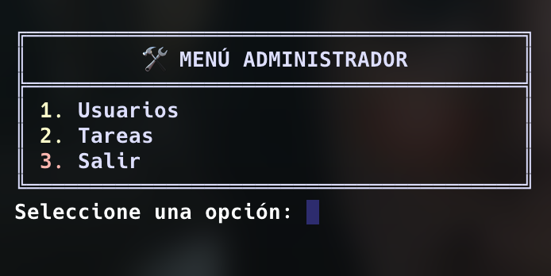
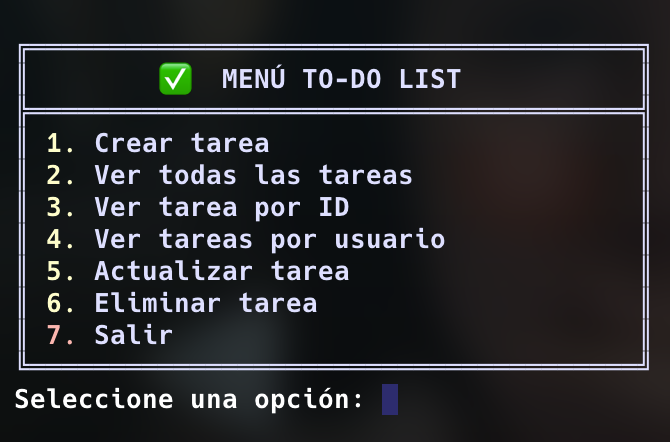

# 📝 Proyecto TODO List - Python Vanilla + PostgreSQL

This repository contains the **backend** of a console-based To-Do List application built with **Python**, **PostgreSQL**, and the **MVC architecture pattern**, using **SQLAlchemy** and **Alembic** for ORM and migrations. It was later extended to support a REST API to connect with a React frontend.

> 🔐 The application includes a login system with role-based access. Admin users can manage both tasks and users. Regular users can manage only their tasks.

## 🖼️ Console App





---

## 💡 Key Concepts

-   Virtual environments and professional project structure
-   PostgreSQL integration with Python using pg8000
-   ORM with SQLAlchemy
-   Alembic for migration handling
-   MVC (Model-View-Controller) pattern
-   Console UI with `input()` and `print()`
-   User authentication and role-based access
-   REST API endpoints
-   API Doc on http://localhost:8000/docs

---

## ✅ Features

### 🔐 Authentication

-   Login with username and password
-   Admin or regular user roles

### 📋 Tasks

-   Create a task (title + description)
-   View all tasks
-   View task by ID
-   Update task (title, description, status)
-   Delete task

### 👥 Users (Admin only)

-   View users
-   Add new users
-   Delete users

---

## 🔧 Technical Stack

-   Python 3.11+
-   PostgreSQL
-   SQLAlchemy
-   Alembic
-   pg8000
-   MVC Architecture
-   FastAPI

---

## 📁 Project Structure

```
todo_list/
├── models/ # SQLAlchemy models
├── controllers/ # Business logic
├── database/ # Database connection
├── views/ # Console interface
├── alembic/ # Database migrations
├── requirements.txt # Dependencies
├── README.md # Documentation
└── ENUNCIADO.md # Original assignment
```

## ⚙️ Installation

1. Clone the repository
   `git clone https://github.com/your-username/backend-todo-list.git`
   `cd backend-todo-list`
2. Create and activate a virtual environment
   `python3 -m venv venv`
   `source venv/bin/activate` # or `venv\Scripts\activate` on Windows
3. Install dependencies
   `pip install -r requirements.txt`
4. Configure your PostgreSQL database connection in .env or database/config.py
   Run Alembic migrations
5. Launch the app
   `python3 -m views.start_menu`
6. Launch Uvicorn (API Server)
   `uvicorn main:app --reload`

📌 Bonus Features
Input validation
Styled and friendly console menu
Colorful feedback messages
Simple User Auth
Rest API
Anything extra the team decided to implement 😉

📜 License
MIT License
